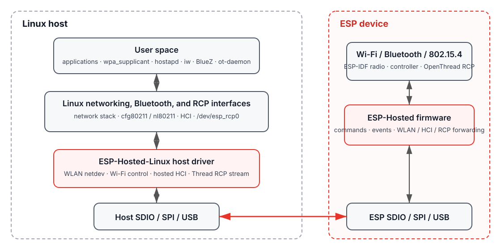

  

# ESP-Hosted-Linux

ESP-Hosted-Linux runs Wi-Fi and Bluetooth on a supported Espressif SoC and exposes standard Linux WLAN and HCI interfaces on the host. Wi-Fi data and control travel over SDIO or SPI. Bluetooth HCI can share that link or use UART on supported setups.

Linux applications stay on normal interfaces: `cfg80211`/`nl80211` handle Wi-Fi control, network data uses the Linux network stack, and Bluetooth uses Linux HCI. Tools such as `wpa_supplicant`, `hostapd`, `iw`, and BlueZ work without a project-specific user-space API.

  

## 🔑 Key capabilities

- Standard Linux WLAN integration: `cfg80211`/`nl80211` control with a normal `wlanX` data path
- Wi-Fi station and access-point modes through `wpa_supplicant` and `hostapd`
- Bluetooth HCI over SDIO or SPI, with optional HCI-over-UART
- SDIO and SPI transports between Linux and the ESP device
- SDIO host sleep and ESP wakeup on supported Linux platforms
- ESP firmware update from Linux over the hosted link
- ESP firmware based on ESP-IDF

## 📦 Transports and targets

| Transport | Supported ESP targets |
|---|---|
| **SDIO** | ESP32, ESP32-C5, ESP32-C6, ESP32-C61 |
| **SPI** | ESP32, ESP32-S2, ESP32-S3, ESP32-C2, ESP32-C3, ESP32-C5, ESP32-C6, ESP32-C61 |

Bluetooth and Wi-Fi PHY capabilities vary by target. [Supported hardware](docs/reference/supported-hardware.md) has the full target table and transport notes.

## 📊 Performance

Best recorded Wi-Fi throughput from available project measurements:

| ESP target | Transport | Peak TCP | Peak UDP |
|---|---|---:|---:|
| ESP32 | SDIO | 43.5 Mbps | 49.1 Mbps |
| ESP32-C3 | SPI | 15.8 Mbps | 17.1 Mbps |
| ESP32-C5 | SDIO | 63.3 Mbps | 97.8 Mbps |
| ESP32-C6 | SDIO | 55.6 Mbps | 90.4 Mbps |
| ESP32-C61 | SDIO | 42.6 Mbps | 64.0 Mbps |

Peak values are maxima from available measurements and may come from different Tx/Rx directions or radio configurations. [Performance](docs/reference/performance.md) has the full measurements and test notes.

## 🚀 Quick start

1. Pick an ESP target and transport from [Supported hardware](docs/reference/supported-hardware.md).
2. Connect the ESP device to the Linux host using [Hardware setup](docs/getting-started/hardware-setup.md).
3. Build and flash ESP firmware using [Build, flash, and load](docs/getting-started/build-and-flash.md).
4. Configure the host bus/GPIO integration, build the matching Linux module, and load it against the running kernel.
5. Continue with [Wi-Fi station](docs/guides/wifi-station.md), [Wi-Fi access point](docs/guides/wifi-access-point.md), or [Bluetooth](docs/guides/bluetooth.md).

For the complete bring-up flow, follow [Quick start](docs/getting-started/quick-start.md). Platform integration details are in [Porting](docs/porting.md).

## 📚 Documentation

- **Getting started** — [Quick start](docs/getting-started/quick-start.md), [hardware setup](docs/getting-started/hardware-setup.md), [build and flash](docs/getting-started/build-and-flash.md)
- **Wi-Fi and Bluetooth** — [Station](docs/guides/wifi-station.md), [access point](docs/guides/wifi-access-point.md), [Bluetooth](docs/guides/bluetooth.md), [host sleep](docs/guides/host-sleep.md), [OTA](docs/guides/ota.md)
- **Architecture** — [Overview](docs/architecture/overview.md), [SDIO](docs/architecture/sdio.md), [SPI](docs/architecture/spi.md)
- **Reference** — [Supported hardware](docs/reference/supported-hardware.md), [performance](docs/reference/performance.md), [repository layout](docs/reference/repository-layout.md), [Raspberry Pi reference setup](docs/reference/raspberry-pi.md)
- **Platform work** — [Porting](docs/porting.md), [troubleshooting](docs/troubleshooting.md)
- **Migration** — [Move from `esp_hosted`](docs/migration.md), [repository origin](ORIGIN.md)

## 🤝 Contributing

Contributions are welcome through GitHub pull requests. [CONTRIBUTING.md](CONTRIBUTING.md) covers the development workflow, commit sign-off, testing, and review.

## 📄 License

This repository contains code under the [Apache License 2.0](LICENSES/Apache-2.0) and [GNU GPL v2 only](LICENSES/GPL-2.0). Check each source file's SPDX identifier for the license that applies to that file. [LICENSES/README.md](LICENSES/README.md) summarizes the project license layout.
