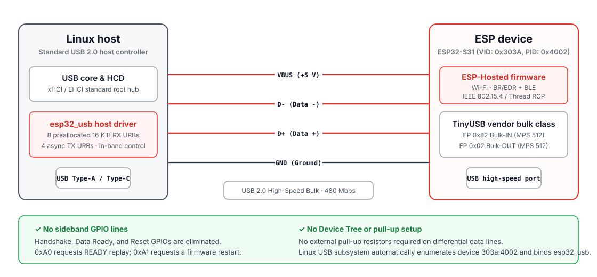

# USB transport

ESP32-S31 uses its native USB 2.0 High-Speed peripheral for the ESP-Hosted USB transport. Linux binds the device to `esp32_usb.ko`.

USB does not use the SPI Handshake/Data Ready lines or a host reset GPIO. Link setup and recovery use the USB data and control pipes.

<p align="center">
  
</p>

See [Hardware setup](../getting-started/hardware-setup.md#usb) for cabling and power notes.

## Device identification and endpoints

| Property | Value | Description |
|---|---|---|
| Vendor ID | `0x303A` | Espressif Systems |
| Product ID | `0x4002` | ESP32-S31 Hosted Network Adapter |
| Speed | High-Speed | USB 2.0, 480 Mbps signaling rate |
| Interface | `0` | Vendor interface |
| Bulk IN | `0x82` | ESP → Linux, 512-byte maximum packet size |
| Bulk OUT | `0x02` | Linux → ESP, 512-byte maximum packet size |

The host discovers the bulk endpoints from the active interface descriptor rather than relying only on fixed endpoint numbers.

## Hosted framing over USB

USB bulk transfers carry a byte stream. ESP-Hosted frames that stream with the same packed 12-byte `struct esp_payload_header` used by SDIO and SPI.

Both sides keep a bounded linear receive accumulator:

1. wait until at least one complete ESP-Hosted header is present;
2. validate interface type, payload length, and offset;
3. wait for the complete frame;
4. queue the frame to the common ESP-Hosted receive path;
5. move any remaining bytes to the start of the accumulator.

The Linux USB driver schedules recovery when it detects framing loss. On firmware, an established RCP session is fail-closed: malformed framing, RCP queue loss, or partial-stream overflow triggers RCP fatal recovery instead of dropping Spinel bytes.

### USB packet-boundary padding

High-Speed bulk endpoints use 512-byte packets. When the firmware sends a logical ESP-Hosted frame whose length is an exact multiple of 512 bytes and is smaller than `ESP_USB_MAX_XFER` (16 KiB), it appends one zero byte. That forces a short USB packet and marks the end of the transfer without relying on a zero-length packet.

The Linux deframer tracks when this pad byte is expected and removes it before parsing the next ESP-Hosted header.

## Linux driver

`host/usb/esp_usb.c` implements the USB backend.

### RX

- 8 persistent RX URBs are allocated at probe time (`ESP_USB_RX_URBS`).
- Each RX buffer is 16 KiB (`ESP_USB_MAX_XFER`).
- RX URBs are anchored so disconnect/recovery can kill them as a group.
- A completed RX URB feeds the stream accumulator and is resubmitted while the transport is running.

### TX

- Common ESP-Hosted priority queues feed the USB TX worker.
- Up to 4 TX URBs can be in flight (`ESP_USB_TX_URBS`).
- Stateful Bluetooth and RCP traffic has explicit flush handling so stale traffic does not cross a reset/session boundary.

## Vendor control requests

The host initiates vendor, interface-recipient control transfers on endpoint 0. The current driver uses `bmRequestType = 0xC1` (device-to-host data stage) so firmware returns a 32-bit request status.

| Request | Code | Firmware action |
|---|---:|---|
| `ESP_USB_VENDOR_REQ_READY_REPLAY` | `0xA0` | Queue a fresh ESP-Hosted boot/ready event |
| `ESP_USB_VENDOR_REQ_SOFT_RESET` | `0xA1` | Schedule an ESP firmware restart with `esp_restart()` |

`READY_REPLAY` is used after probe to obtain the boot event without an external reset line. `SOFT_RESET` is not only a USB endpoint reset; it restarts the ESP firmware.

## Recovery behavior

Recovery depends on the failure:

- a normal probe or re-synchronization request uses `READY_REPLAY`;
- a data-path close/reset request uses `SOFT_RESET`;
- ambiguous USB stream loss or stateful HCI/RCP delivery failure is fail-closed and can restart firmware;
- after firmware returns, ESP-Hosted publishes a fresh boot event and rebuilds the host-side state.

Stateful HCI and Spinel streams are not continued after ambiguous byte loss.

## Hosted payloads

The USB bulk pipe carries Wi-Fi data, commands/events, hosted Bluetooth HCI, and hosted Thread RCP traffic. The common header identifies the interface and packet type. Bluetooth and RCP endpoints are created only when the corresponding runtime radio service is active.

See [Architecture overview](overview.md#transport-payload) and [IEEE 802.15.4 / Thread RCP](../guides/thread-rcp.md).

## Bring-up checklist

1. Connect ESP32-S31 to a High-Speed-capable USB host port with a known-good data cable.
2. Check enumeration:

   ```sh
   lsusb -d 303a:4002
   ```

3. Load/check the module:

   ```sh
   lsmod | grep esp32_usb
   ```

4. Check endpoint discovery and the boot event:

   ```sh
   dmesg | grep -i -E 'usb|esp32_usb|esp'
   ```

5. Check Wi-Fi:

   ```sh
   iw dev
   ```

6. If Bluetooth or Thread is required, check the active secondary-radio service:

   ```sh
   cat /sys/module/esp32_usb/parameters/radio_service_active
   ```

[USB troubleshooting](../troubleshooting.md#usb-device-is-not-detected) covers the initial enumeration path.
