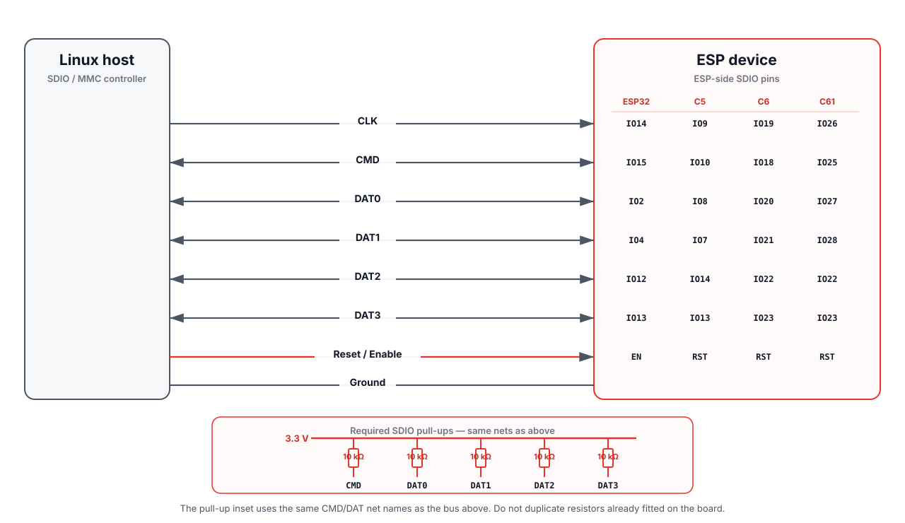
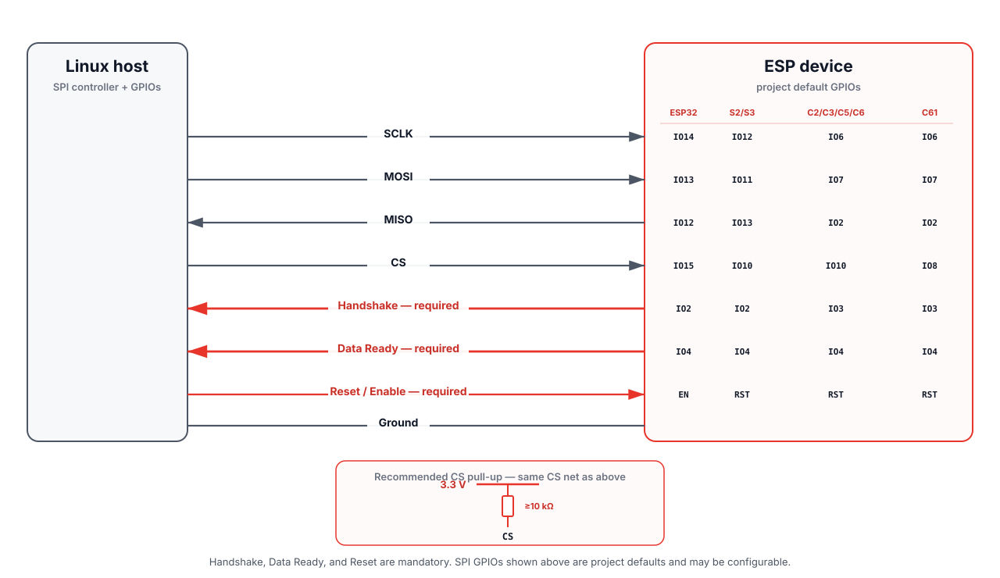

# Hardware setup

ESP-Hosted-Linux connects an ESP device to a Linux host over SDIO or SPI. Both transports need a shared ground and a host-controlled ESP reset/enable signal. SPI additionally requires **Handshake** and **Data Ready** GPIOs from ESP to the host.

All interface signals are 3.3 V logic. Do not connect them to 5 V logic without level shifting. Map the signals below to the Linux host's bus controller, pinctrl, and GPIO resources.

Pick a target and transport from [Supported hardware](../reference/supported-hardware.md), then use the matching section below.

## SDIO

ESP-Hosted SDIO uses CLK, CMD, DAT0-DAT3, reset, and ground. **CMD and DAT0-DAT3 require pull-ups.** ESP-IDF calls for pull-ups on these lines, including unused data lines. See [ESP-IDF SD Pull-up Requirements](https://docs.espressif.com/projects/esp-idf/en/stable/esp32/api-reference/peripherals/sd_pullup_requirements.html) for resistor guidance and board/module compatibility.

<strong>SDIO wiring diagram and electrical notes</strong>

  

The diagram shows external 10 kΩ pull-ups. Do not add duplicate resistors when the selected board already provides suitable pull-ups; check the board schematic and ESP-IDF guidance.

For bring-up, keep wiring short, provide a solid ground path, fit the required pull-ups, and lower the SDIO clock if transfers are unstable. Use a PCB or purpose-built interconnect for repeatable high-speed results.

On the Linux host, configure the MMC/SDIO controller, pinctrl, reset GPIO, and interrupt handling required by the platform.

<strong>ESP SDIO default GPIOs</strong>

| Function | ESP32 | ESP32-C5 | ESP32-C6 | ESP32-C61 |
|---|---|---|---|---|
| DAT3 | IO13 | IO13 | IO23 | IO23 |
| CLK | IO14 | IO9 | IO19 | IO26 |
| CMD | IO15 | IO10 | IO18 | IO25 |
| DAT0 | IO2 | IO8 | IO20 | IO27 |
| DAT1 | IO4 | IO7 | IO21 | IO28 |
| DAT2 | IO12 | IO14 | IO22 | IO22 |
| ESP reset | EN | RST | RST | RST |

## SPI

**SPI requires Handshake and Data Ready.** Both GPIOs must be assigned in the ESP firmware and Linux host configuration and physically connected between ESP and host. They are required for normal SPI operation.

<strong>SPI wiring diagram and electrical notes</strong>

ESP-Hosted SPI uses SCLK, MOSI, MISO, chip select, reset, ground, Handshake, and Data Ready.

  

**A pull-up of at least 10 kΩ on chip select helps keep the line from floating during reset or boot.**

On the Linux host, configure the SPI controller, chip select, reset GPIO, and interrupt-capable GPIO inputs for Handshake and Data Ready. Keep the firmware GPIO assignments and physical wiring consistent with that host configuration.

<strong>ESP SPI default GPIOs</strong>

| Function | ESP32 | ESP32-S2/S3 | ESP32-C2/C3/C5/C6 | ESP32-C61 |
|---|---|---|---|---|
| CS | IO15 | IO10 | IO10 | IO8 |
| SCLK | IO14 | IO12 | IO6 | IO6 |
| MISO | IO12 | IO13 | IO2 | IO2 |
| MOSI | IO13 | IO11 | IO7 | IO7 |
| Handshake (ESP → host) | IO2 | IO2 | IO3 | IO3 |
| Data Ready (ESP → host) | IO4 | IO4 | IO4 | IO4 |
| ESP reset | EN | RST | RST | RST |

These are the project defaults. Keep the active ESP firmware configuration and Linux host integration consistent if GPIO assignments are changed.

## Bluetooth HCI over UART

Bluetooth HCI can optionally use UART while Wi-Fi continues over SDIO or SPI. ESP firmware must be built for HCI UART, and host and ESP must use the same baud rate and flow-control mode.

<strong>ESP UART default GPIOs</strong>

| ESP target | TX | RX | RTS | CTS | Wiring |
|---|---|---|---|---|---|
| ESP32 | IO5 | IO18 | IO19 | IO23 | 4-wire or 2-wire |
| ESP32-S3 | IO17 | IO18 | IO19 | IO20 | 4-wire or 2-wire |
| ESP32-C3 | IO5 | IO18 | IO19 | IO8 | 4-wire or 2-wire |
| ESP32-C2 | IO5 | IO18 | — | — | 2-wire |
| ESP32-C5 | IO23 | IO24 | — | — | 2-wire |
| ESP32-C6 | IO5 | IO12 | — | — | 2-wire |
| ESP32-C61 | IO13 | IO12 | — | — | 2-wire |

For ESP32, ESP32-S3, or ESP32-C3, a two-wire TX/RX setup is possible when hardware flow control is disabled in firmware. C2/C5/C6/C61 project defaults use two-wire UART with flow control disabled.

On the Linux host, map TX/RX and, when used, RTS/CTS to an available UART. Remove any serial console or other service that owns the selected UART before attaching it to the Linux Bluetooth stack. [Bluetooth](../guides/bluetooth.md) covers HCI attachment.

## Power and reset

These points apply to every transport and Linux host:

- use a stable power supply suitable for the host and ESP hardware
- power ESP development boards through a supported board power input
- connect the required host-controlled reset/enable GPIO so Linux can reset ESP during initialization or recovery
- connect host and ESP grounds

Continue with [Build, flash, and load](build-and-flash.md). Platform integration details are in [Porting](../porting.md).
